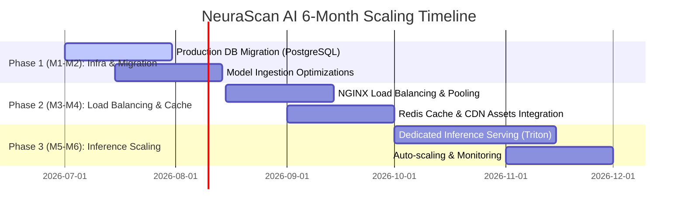

# Challenge 5: The Scalability Roadmap (6-Month Plan)

This roadmap details the progressive architectural changes required to scale NeuraScan AI from a single-clinic service (10 active clinicians) to an enterprise-grade medical imaging platform (10,000 active users).



---

## Month 1 - Month 2: Database Migration & Basic Infrastructure
**Goal**: Transition from local dev databases to high-concurrency storage systems.

### 1. Database Optimization: PostgreSQL Transition
- **Action**: Migrate the local SQLite database to a fully managed PostgreSQL instance (e.g. AWS RDS PostgreSQL).
- **Optimization Tech**:
  - Implement connection pooling using **PgBouncer** to support concurrent connections without memory exhaustion.
  - **Indexes**: Create composite indexes on frequently-queried columns:
    ```sql
    CREATE INDEX idx_patients_status_risk ON patients(status, riskCategory);
    CREATE INDEX idx_mri_scans_patient_date ON mri_scans(patientId, date DESC);
    CREATE INDEX idx_audit_logs_timestamp ON audit_logs(timestamp DESC);
    ```

### 2. Payload Storage
- Move local `static/sessions` folder files to a centralized cloud object storage (e.g., AWS S3 with KMS encryption).
- Save only the S3 asset paths in the `mri_scans` database table to keep rows lightweight.

---

## Month 3 - Month 4: Caching, Load Balancing & CDN Layers
**Goal**: Distribute network traffic and cache heavy visual data to minimize CPU/IO bottlenecks.

### 1. Load Balancing & Flask Containerization
- **Containerization**: Pack the Flask API and React assets into Docker containers.
- **Horizontal Scaling**: Deploy the API container onto **AWS ECS (Elastic Container Service)** or **Kubernetes (EKS)**.
- **Load Balancer**: Deploy an **Application Load Balancer (ALB)** in front of the API containers to route requests using round-robin/least-connections logic.

### 2. CDN Asset Caching (CloudFront)
- **Problem**: Serving large structural MRI files and high-resolution Grad-CAM overlays directly from Flask creates bandwidth saturation.
- **Solution**: Configure a CDN (e.g. **AWS CloudFront**) with signed URLs to cache static assets close to hospital clinicial endpoints.
- Preprocessed slices (`step1` through `step4`) and Grad-CAM overlays are cached at Edge nodes with custom cache-control headers, reducing roundtrip latency.

### 3. Redis In-Memory Cache
- Deploy a clustered **Redis** instance to cache user session profiles and token validations.
- Cache computed analytics results for the Clinic Stats view (e.g., disease distributions, monthly trend lists) to prevent database queries during peak operational hours.

---

## Month 5 - Month 6: Enterprise Model Serving & GPU Auto-Scaling
**Goal**: Optimize deep learning execution to prevent model inference from bottlenecking API response times.

### 1. Model Porting & Specialized Serving (Triton / TorchServe)
- **Problem**: Running PyTorch models directly inside Flask workers causes memory leaks and locks Python's Global Interpreter Lock (GIL).
- **Solution**: Decouple model inference from the Flask server. Port the `DementiaNet` model to **Triton Inference Server** or **TorchServe**:
  - Run inference inside optimized runtimes (ONNX Runtime or TensorRT).
  - Enable **Dynamic Batching** to group multiple independent scans into single GPU evaluation passes, decreasing latency by up to 4x.
  - Enable **Model Concurrency** to run multiple model instances on a single GPU.

### 2. GPU Auto-scaling Groups
- Deploy Triton servers on GPU-optimized nodes (e.g. AWS EC2 g4dn/g5 instances).
- Configure **Horizontal Pod Autoscaling (HPA)** based on GPU duty-cycles. If average GPU utilization exceeds 75% for over 2 minutes, auto-spin new model serving containers.

### 3. Asynchronous Task Queuing (Celery + RabbitMQ)
- For larger 3D MRI volumes (like NIfTI sequences), process pipelines asynchronously:
  - Return a `202 Accepted` status code to the client immediately.
  - Send the processing request to a **Celery** task queue backed by **RabbitMQ**.
  - Worker nodes strip, segment, and classify the image in the background.
  - Notify the React client via **WebSockets** when the results are saved to the PostgreSQL database.
