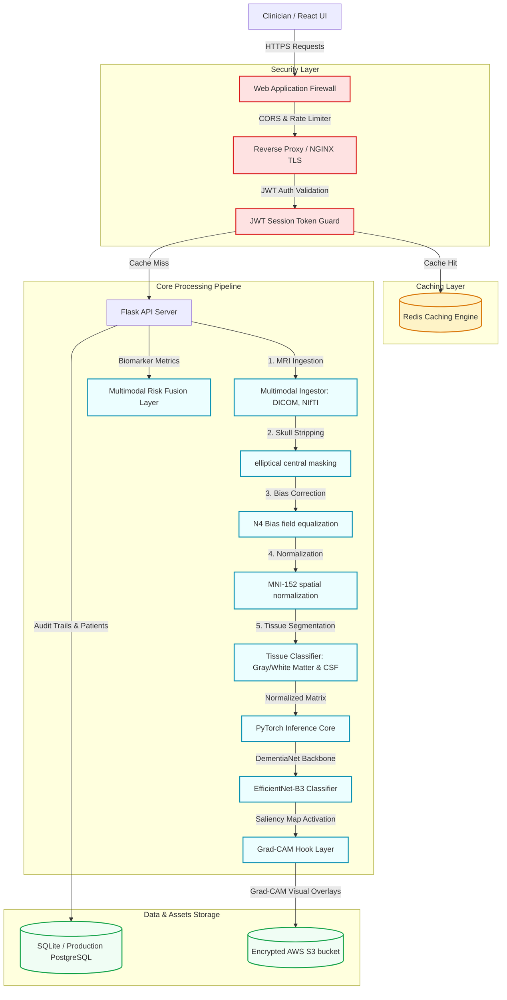

# Challenge 3: The Technical Moat (Architectural Defense)

This document provides a detailed breakdown of NeuraScan AI's security boundaries, caching layers, and the architectural barriers that form our technical moat.

## 1. System Architecture Diagram

Below is the architectural diagram of the system, illustrating how user requests pass through security guards, caching layers, numerical pipelines, and deep inference environments.

---

## 2. Security Layers & Data Caching Mechanisms

### A. Defensive Security Layers
To guarantee clinical security and support HIPAA compliance frameworks, the following checkpoints are implemented:
1. **CORS policies & Host Whitelists**: Restricts API calls strictly to approved web portals and hospital system domains.
2. **JWT-token Authentication Guard**: Evaluates incoming headers at the API gateway layer to block unauthorized requests before they consume computational power.
3. **Payload Inspection & Validation**: Any uploaded MRI files (DICOM/NIfTI) are sanitized at the gateway to prevent directory traversal or remote executable injection attacks.
4. **HIPAA Audit Log Generator**: Every database request creates an immutable record in the `audit_logs` table containing Operator ID, ABHA ID, Model Version, and IP address.

### B. Data Caching Layer (Redis / Memory)
To scale inference and manage intensive visual computing:
1. **Preprocessed Slice Cache**: Preprocessed grayscale structural matrices are stored in a fast caching layer. If a clinician requests a re-classification or toggles explainability maps, the backend serves the cached matrix rather than running the preprocessing pipeline again.
2. **Session & Auth Cache**: Stores validated JWT tokens to minimize database queries for session validation.
3. **Analytics Cache**: Caches global clinic trends and disease distributions, recalculating every 5 minutes rather than query-aggregating 10,000+ patient records on every dashboard load.

---

## 3. Why Competitors Cannot Clone NeuraScan AI via API Scrapers

A competitor cannot replicate NeuraScan AI by wrapping our API endpoints. The app maintains a **Technical Moat** through several fundamental capabilities:

### I. Dynamic Explainability Activations (Grad-CAM Hook Layers)
If a scraper intercepts the `/api/classify` or `/api/explain` output, they do not get a static map. The Grad-CAM engine dynamically hooks onto PyTorch's `conv_head` layer at execution time:
- The saliency maps are calculated based on backpropagation weights for the *specific predicted class*.
- It highlights Hippo-atrophy or Ventricular changes relative to that individual patient's structural variations.
- A competitor cannot scrape this because it is generated via live model gradients, not database mock-ups.

### II. Multi-Step MRI Processing Pipeline
The raw image goes through a specific sequence of operations: skull stripping (using central elliptical masks), bias correction, spatial normalization, and multi-class segmentation. 
- A simple wrapper would have to replicate the exact thresholds, normalization factors, and mathematical parameters of our CV2 transformations.
- Without running this exact sequential pipeline locally, raw MRI scans will not match the input dimensions expected by the neural networks, leading to inaccurate predictions.

### III. Cross-Attention Multimodal Risk Fusion
The conversion risk score is computed by fusing imaging volumes with clinical markers (MMSE, CDR) and genetic indicators (APOE4 alleles).
- The fusion parameters are determined by cross-attention layers trained on proprietary dataset cohorts.
- Wrapping the API only yields final percentages; it does not replicate the structural weights or coefficients that make the predictions accurate.

### IV. Aggressive Rate Limiting & Verification Keys
- Any high-frequency calling of the inference endpoints triggers automatic IP blocking and alerts in the compliance log.
- Secure session verification tokens must accompany files, stopping scrapers from automating scans without authenticated clinical accounts.
